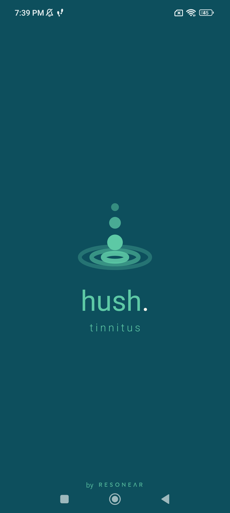
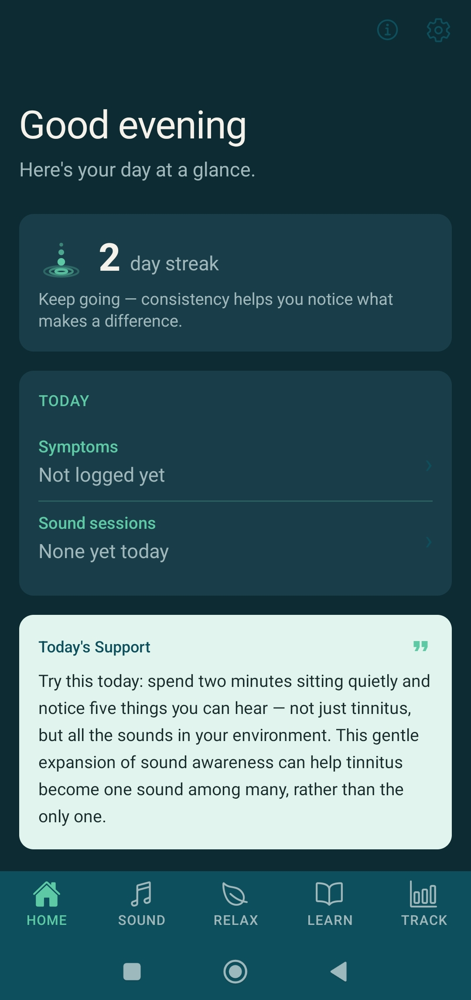
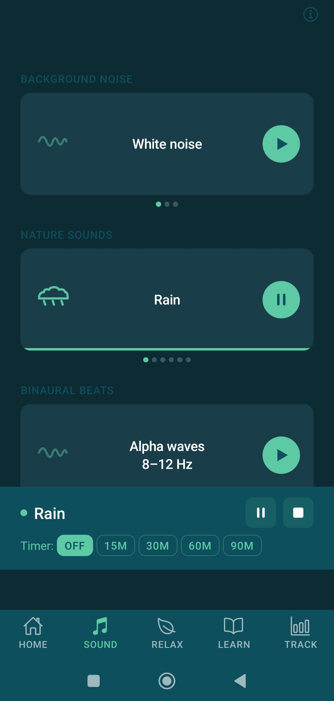
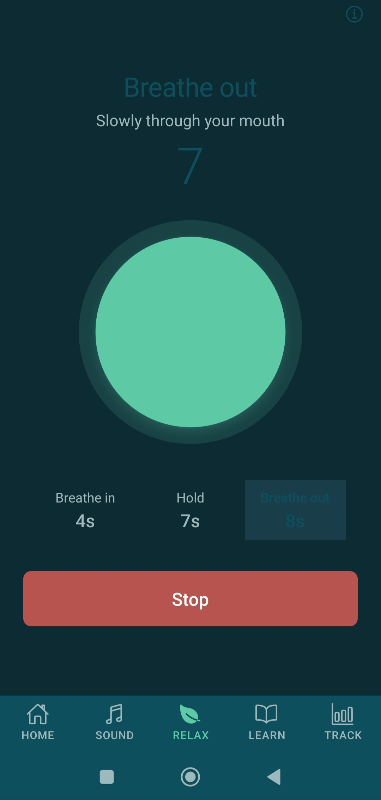

## 🎧 Hush Tinnitus
### Sound therapy & tinnitus self-management for Android

A clinician-backed mobile app providing evidence-based self-management tools for people living with tinnitus — built independently with a registered audiologist. Launching on Android via the Google Play Store.

---

## 📸 Screenshots
| Load | Home | Sound | Breathe |
|-------|---------------|--------|--------|
|  |  |  |  |

---

## 🛠️ Tech Stack

| Layer | Technology |
|-------|-----------|
| Framework | React Native (Expo SDK 54) |
| Language | TypeScript |
| Navigation | Expo Router (file-based) |
| Audio | react-native-audio-api |
| Animation | React Native Reanimated 3 |
| Storage | expo-sqlite (fully on-device) |
| Charts | react-native-svg |
| PDF Export | expo-print + expo-file-system |
| Build | EAS Build (cloud) |

---

## 🎵 What It Does

**Sound Therapy**
Synthesised white, pink, and brown noise generators; six nature soundscapes (rain, ocean waves, stream, forest, fire, café ambience); binaural beats at alpha (8–12Hz) and theta (4–8Hz) frequencies; a logarithmic pitch matching tool (100Hz–16kHz); and notched therapy mode based on Okamoto et al. (2010). All sounds support persistent background audio — playback continues during phone calls and screen lock.

**Guided Relaxation**
4-7-8 breathing and box breathing with real-time animated visual guides, diaphragmatic breathing, progressive muscle relaxation, body scan meditation, mindfulness tinnitus acceptance, guided imagery, and a combined sleep preparation routine.

**CBT Psychoeducation**
Tinnitus 101, the neurological loop (attention and threat-response model), a guided thought journal with CBT reframe flow, a personalised sleep hygiene checklist, a noise exposure guide with dB reference chart, a red flag symptom guide, and an evidence citations screen linking to primary literature.

**CREST Assessment**
A proprietary 12-question tinnitus impact scale developed exclusively for the app by Michael McDonald BSc (Hons), AAudA. The CREST (Compact Rating and Experience of Symptoms in Tinnitus) scale measures six clinical domains — intrusion, emotional wellbeing, cognitive function, sleep, social life, and sense of control — on a plain-language 5-point scale, producing a 0–100 score with severity banding and domain breakdown. Retesting is prompted at week 4 and week 8 with delta tracking and clinically meaningful change indicators.

**Progress Tracking**
Daily symptom logging (loudness, distress, time of day, notes), trigger tagging, longitudinal SVG charts, CREST score trend lines, a session counter, and a one-tap clinician PDF export formatted as a plain-text report suitable for sharing with an audiologist.

---

## 💰 Freemium Model

Core features are permanently free — no account required.

| Free | Premium (~AU$8.99/mo) |
|------|----------------------|
| Sound therapy (all sounds) | 3-source sound mixer |
| 4-7-8 & box breathing | Per-ear balance control |
| Tinnitus 101 & neurological loop | Full relaxation library |
| CREST assessment | CBT thought journal |
| Basic symptom log | Trigger tagging & pattern analysis |
| Daily support messages | Longitudinal progress charts |
| | Clinician PDF export |

---

## 🏗️ Architecture Decisions

**Why fully on-device storage?**
Tinnitus is a sensitive health condition. Storing all data in expo-sqlite on the user's device means nothing leaves the phone without explicit user action. No account is required to use the app and no data is transmitted to any server, which builds trust with a health-conscious audience and avoids GDPR/Privacy Act complexity at launch.

**Why a proprietary assessment scale?**
The two most widely used tinnitus questionnaires (TFI and THI) both require commercial licensing from their respective copyright holders. Rather than navigate that complexity, we developed the CREST scale in-house with a registered audiologist — covering the same six clinical domains as existing validated instruments, using a more accessible plain-language response format designed for older users.

**Why file-based audio for high-frequency pitch matching?**
The Web Audio API oscillator in react-native-audio-api has a confirmed Android limitation above ~12kHz. For pitch matching above that threshold, pre-generated sine wave MP3 files are used instead of live oscillator synthesis, bypassing the library bug entirely while maintaining accuracy across the full 100Hz–16kHz range.

**Why Expo over bare React Native?**
EAS Build handles cloud-based APK generation without requiring a local Android SDK setup. Expo Router's file-based navigation keeps the route structure readable and maintainable. The trade-off is occasional native module complexity, but for a two-person team the productivity gains outweigh the constraints.

---

## 🚀 Running Locally

```bash
# Clone the repo
git clone https://github.com/rachelmcdonald/HushTinnitus
cd HushTinnitus

# Install dependencies
npm install

# Start the dev server
npx expo start --dev-client
```

Scan the QR code with the Hush Tinnitus development build installed on your Android device.

### Building with EAS

```bash
# Install EAS CLI
npm install -g eas-cli

# Log in to your Expo account
eas login

# Trigger a development build
eas build --profile development --platform android
```

---

## 🗺️ Planned Features

- iOS release following Android launch
- Cloud sync of symptom log via optional account creation
- AI-powered tinnitus companion (conversational support)
- Audiologist B2B portal for assigning the app to patients
- 8-week structured CBT programme (one-time purchase)
- Apple Health and Google Fit integration

---

## ⚕️ Medico-Legal

This app is a wellness and self-management tool — not a medical device. It does not diagnose, treat, cure, or prevent tinnitus. All in-app copy avoids the words treat, cure, relief, and diagnose.

Evidence base: habituation model (Jastreboff 1990), CBT for tinnitus (Henry & Wilson 2001), notched therapy (Okamoto et al. 2010), sleep and tinnitus (Lasisi et al. 2018), NICE NG155 (2020).

---

## 💡 Why We Built This

Tinnitus affects an estimated 750 million people worldwide, yet the self-management tools available are either clinically shallow, hidden behind aggressive paywalls, or simply not built with audiologists involved in the process. After years of working with tinnitus patients in NHS Scotland and specialist audiology clinics in Perth, Western Australia, Michael saw firsthand how little practical day-to-day support people had between appointments.

We built Hush Tinnitus because we believed people deserved something better than generic wellness apps and subscription-driven platforms — something calmer, more clinically grounded, and genuinely useful to return to every day.

---

*Built by Rachel McDonald (Developer) and Michael McDonald BSc (Hons), AAudA (Audiologist) — Perth, Western Australia.*
